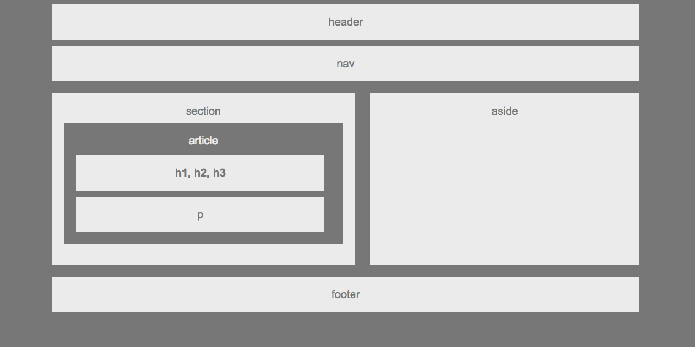

# HW-Wireframe
Assignment_Wireframe

# Link to deployed site
https://lalatw.github.io/HW-Wireframe/


# Images
 

# Technology used
* html
* css


# Code snippets


```
    <div class="container">
    
        <section>
            
            section

            <article>article

                <div class="headers">h1, h2, h3</div>
            
                <p>p</p>

            </article>

        </section>

        <aside>aside</aside>

    </div>

```


# Learning points
* Use “div” and “section” tags to group content or elements in HTML.
* Use “class” attribute to define certain elements or content along with “div” or “section” so as to better style them with CSS.
* Apply CSS Box Model concept to change layout by adjusting margin, padding, etc.
* Define font and color in CSS to present the desired design.
* Use CSS “float” and “clear” to align elements.


# Author 
[Shuhan Laura Lee](https://lalatw.github.io/HW-Wireframe/)


# License
Standard MIT License